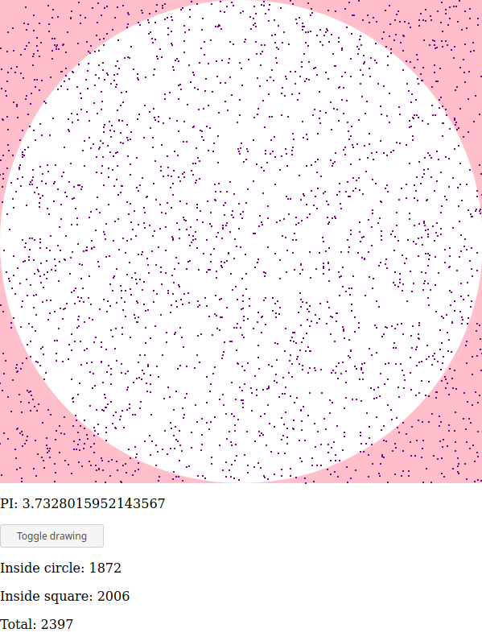

# PI estimation with Monte Carlo Method in Elm

Simple project I made to learn more about functional programming and Elm itself.

## Build index.html file

```
elm make src/Counter.elm
```

## Start estimation
Just open *index.html* file which should be generated with previous build command.

